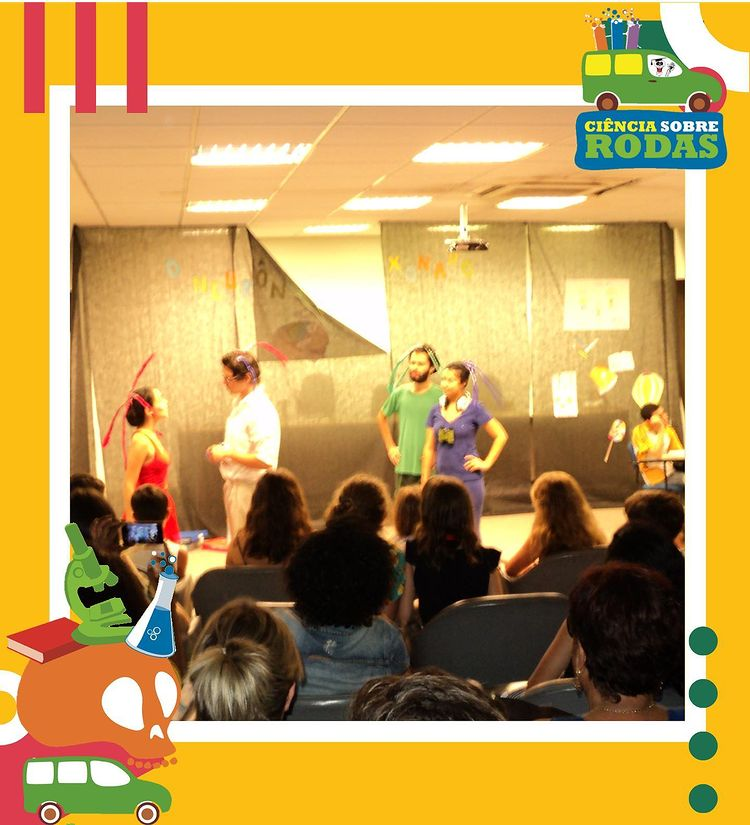

Uma adaptação do livro infantil "O Neurônio Apaixonado", do professor [Roberto Lent](http://buscatextual.cnpq.br/buscatextual/visualizacv.do?id=K4783576H5), para o teatro. Ideia da professora [Patrícia Garcez](http://buscatextual.cnpq.br/buscatextual/visualizacv.do?id=K4704003T8) (que também atuou na peça) levada a cabo com as pessoas que na época compunham o meu grupo de teatro (os [Utópicos](https://www.youtube.com/channel/UCQDbZ5WFSk-CQzntcqY4IOA)).

[Adaptação de texto](https://www.dropbox.com/s/qygf0u1z96j5bpx/Neur%C3%B4nio%20Apaixonado%20-%20roteiro.pdf?dl=0) minha, orçamento de R$ 50, equipe e elenco voluntários. Mas o efeito foi ótimo quando apresentamos como encerramento do Encontro de Extensão do ICB (2015).

, cortesia do [Ciência sobre Rodas](https://www.instagram.com/cienciasobrerodasufrj/).")