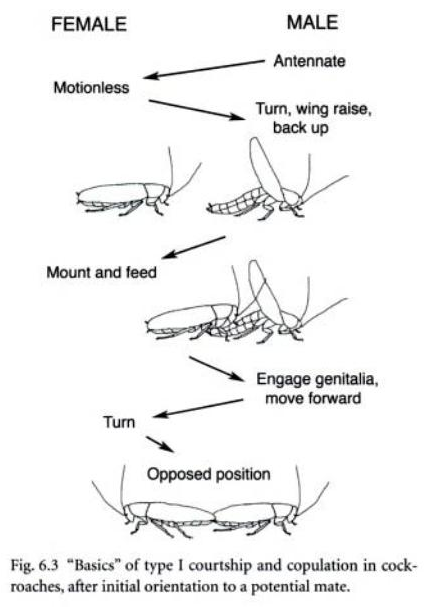

Eu tinha uns 10 ou 11 anos. Estava no trabalho da minha mãe. Senti algo andando na parte de trás do meu pescoço. Num movimento rápido eu peguei a coisa, que para minha surpresa, era uma barata (que também estava bastante surpresa com o acontecido, imagino). A encarei por alguns momentos enquanto ela se debatia descontroladamente entre meus dedos, antes de jogar no chão e pisar nela. Depois desse episódio, por sorte, não fiquei traumatizado pelo inseto, passei até a ficar menos tenso na presença dele.

Baratas andam no esgoto, carregam inúmeros tipos de bactérias, fungos, vírus, vermes e protozoários. Elas podem te morder (mas só em raras ocasiões) e eu posso dizer por experiência própria que a sensação gerada por uma delas andando em você não é das mais agradáveis. Mas nada disso significa que elas não sejam animais interessantes, se a gente deixa a hostilidade com elas de lado brevemente.

Por exemplo, elas vivem relativamente bem sem cabeça. Sim, elas teriam menos problemas com radiação do que nós. Elas comem qualquer coisa - sabão, couro, cabelo, papel, queijo, outras baratas, aquele pedacinho de biscoito que você deixou cair semana passada entre o sofá e a parede - e sobrevivem muito tempo sem comer. Ainda, elas possuem a incrível capacidade de, em poucos segundos e sem esforço quase nenhum, fazer algumas pessoas passarem de um estado relaxado e tranquilo para um estado louco, de completo desespero. Em grande sacada comercial, várias empresas criaram toda uma indústria em cima dessa capacidade das baratas.

Tem outro aspecto interessante da vida das baratas. Um mais íntimo. Você já se perguntou como baratas se reproduzem? Não? Eu já (e talvez eu tenha um problema).

Assim como em humanos (às vezes), antes do ato de cópula em si, há toda a fase de corte. A barata macho tenta seduzir a fêmea com demonstrações de sua virilidade, tentando seduzi-la, mostrar que é um bom pretendente. O macho da barata começa a flertar na presença de feromônios, substâncias liberadas pela fêmea quando ela está pronta para acasalar. Pra começar, o macho fica muito mais ativo: se movimentando e correndo mais do que o normal, fazendo movimentos rápidos com as antenas. Mas nada se compara a todo o lance sexy de se virar de costas para a fêmea com as asas erguidas, exibindo seu corpo escultural e secretando substâncias pra atrair a fêmea    .

Vejamos uma ilustração:

Lindo, né? Se a sua curiosidade supera o seu nojo, você pode ver a coisa real, em vídeo (incrível o que você encontra na internet). Preciso alertar para o fato de que o vídeo abaixo contém imagens explícitas e fortes de sexo entre duas baratas (como bônus, você pode ver os vídeos que o algoritmo do YouTube vai passar a te sugerir a partir de agora: inúmeras espécies diferentes se cortejando e copulando).



Na maior parte do vídeo o macho está se exibindo para a fêmea sem muito sucesso. Como falei antes: ele vira de costas, ergue as asas, corre em volta dela - e ela nem aí. Por volta de 1:30 ele finalmente consegue.

Aquilo - as duas baratas atracadas pelas suas regiões posteriores sem demonstrar muita emoção - é o sexo das baratas (o que me lembra [daquela música dos Mamonas Assassinas](https://www.youtube.com/watch?v=J_u3T4A-2Ko)). Elas permanecem assim por um longo tempo (mesmo sem pílulas azuis ou Boston Medical Group): tipicamente entre 1h e 1h30. Entretanto, algumas espécies passam de 24 horas. Depois de uma semana você vê o resultado: a fêmea produz uma ooteca - uma bolsa abdominal - contendo cerca de quinze ovos. Seis a oito semanas depois, as baratinhas saem dos ovos e começam tudo de novo.

Da próxima vez que a sua casa for visitada por um desses distintos insetos e alguém estiver desesperado, você tem um ótimo assunto pra puxar e tentar distrair a pessoa: “sabe, algumas espécies de barata passam mais de 24 horas acasalando ...”.

Referências: Barth, R. H. (1970). The Mating Behavior of Periplaneta americana (Linnaeus) and Blatta orientalis Linnaeus (Blattaria, Blattinae), with Notes on 3 additional Species of Periplaneta and Interspecific Action of female Sex Pheromones1. Zeitschrift für Tierpsychologie, 27(6), 722-748. Seelinger, G. (1984). Sex‐specific Activity Patterns in Periplaneta americana and their Relation to Mate‐finding. Zeitschrift für Tierpsychologie, 65(4), 309-326. Bell, W. J., Roth, L. M., & Nalepa, C. A. (2007). Cockroaches: ecology, behavior, and natural history. JHU Press. http://entnemdept.ufl.edu/creatures/urban/roaches/american_cockroach.htm http://www.cdc.gov/nceh/publications/books/housing/cha04.htm 