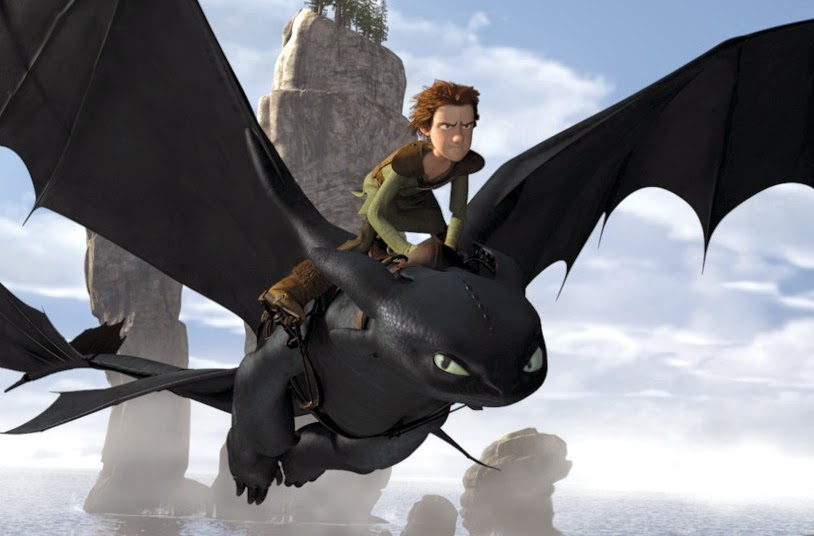
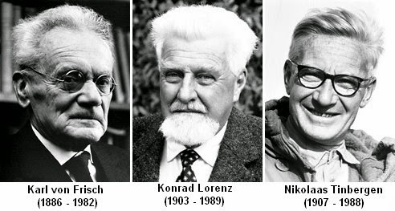
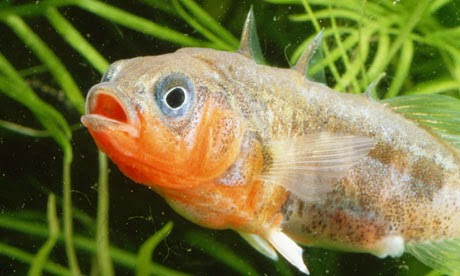
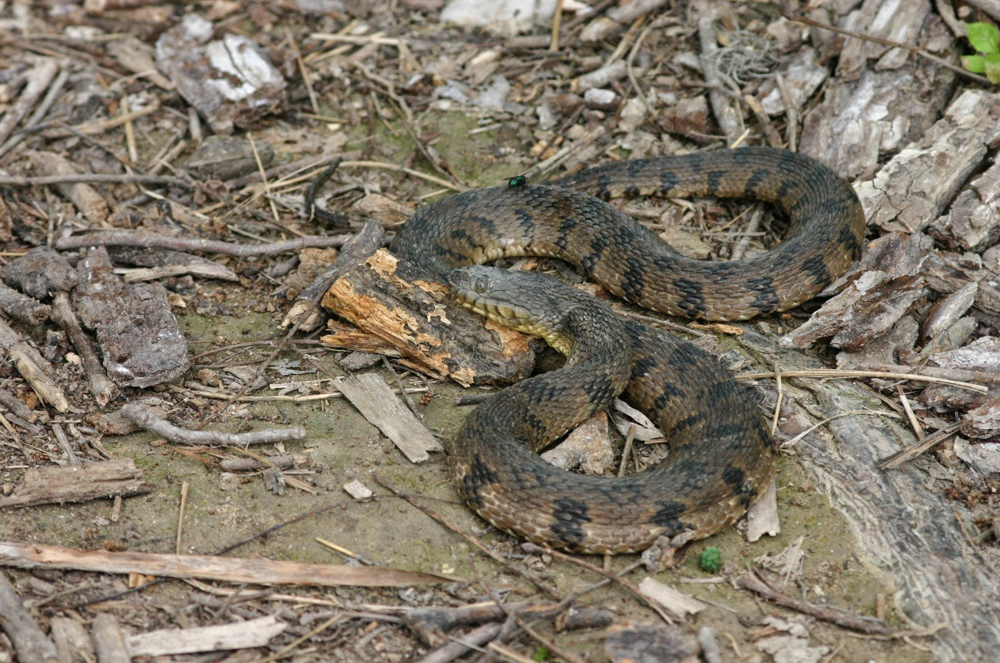

        ---
author: kleberneves
date: "2021-02-18T19:18:21+00:00"
title: Sobre etologia e dragões

---
Eu gosto bastante de animações. _Pixar_, _Disney_, _DreamWorks_. Confesso que _[Como treinar seu dragão](https://www.youtube.com/watch?v=oKiYuIsPxYk)_ parecia até meio bobo pelo título mas acabou se tornando uma das minhas animações favoritas. A história é ótima, a qualidade gráfica também, dragões sempre ajudam. Mas uma coisa que me chamou a atenção foi o comportamento desses dragões no filme.

**Spoilers abaixo!**

Soluço acaba se tornando o cara dos dragões usando truques que ele aprende ao lidar com o seu próprio dragão. Por exemplo, ele nota que Banguela não gosta de enguias e se derrete com um carinho no papo. Depois ele usa isso pra manipular outros dragões e se tornar o guerreiro "matador" de dragões, surpreendendo todo mundo.

Agora, essa coisa toda de observar comportamentos e respostas pré-definidas (o medo/aversão, ou se derreter todo) a estímulos específicos (enguias, carinho no lugar certo) remetem às histórias clássicas da etologia.

Etologia é o estudo do comportamento animal em condições naturais, em oposição a estudar em condições artificiais num laboratório. A etologia começou com três caras (que depois ganharam o prêmio Nobel por esse trabalho pioneiro): [Konrad Lorenz](https://pt.wikipedia.org/wiki/Konrad_Lorenz), [Nikolaas Tinbergen](https://pt.wikipedia.org/wiki/Nikolaas_Tinbergen) e [Karl von Frisch](https://pt.wikipedia.org/wiki/Karl_Ritter_von_Frisch).  

Lorenz estudou o comportamento de corvos, gansos, insetívoros e várias outras espécies (ele conta vários episódios interessantes no livro [King Solomon's Ring](http://www.estantevirtual.com.br/q/falava-com-bestas-aves-peixes)). O trabalho mais importante de Karl von Frisch foi entender o significado da comunicação por [dança das abelhas](https://www.youtube.com/watch?v=bFDGPgXtK-U). Tinbergen (grande amigo de Lorenz até brigarem: um era judeu e o outro nazista) passou um bom tempo explorando os chamados padrões fixos de ação - uma sequência de comportamentos que é automaticamente disparada por um estímulo específico, bem como o que o Soluço explora nos dragões do filme (e mais claramente ainda na [série do Cartoon Network](https://www.youtube.com/watch?v=KZdyn2ofCXA)).

Uma boa história da etologia vem dos peixes. O peixinho _stickleback_ (da família _Gasterosteidae_, se alguém quiser saber) fica agressivo e territorialista durante a época de acasalamento. Ele ataca outros machos que se metem a nadar pela sua área.  

A questão é: como ele sabe que o que ele está atacando é um outro macho? Será que ele tem um sistema visual complexo que reconhece um peixe macho rival? Niko Tinbergen suspeitou que o peixe não tinha um sistema tão sofisticado pra reconhecer peixes machos da sua espécie. Talvez ele tivesse um macete qualquer.

Pra tentar descobrir o que estava acontecendo, Niko Tinbergen construiu três modelos de “peixe”:

- um bem realista, mas todo prateado/cinza;
- um bem simples, mas com a barriga vermelha, assim como os _stickleback_ machos;
- um outro, com a barriga vermelha também, mas com formato diferente do _stickleback_, mais arredondado.

Depois ele apresentou os três “peixes”, um de cada vez, para um stickleback de verdade. Veja por você o que acontece:



Se lembra um peixe e tem a barriga vermelha: ao ataque. Por outro lado, o _stickleback_ ignora completamente o modelo mais realista. Se não tem a barriga vermelha, ele deixa pra lá. Parece que ele realmente tem um "macete" pra saber o que é um rival e o que não é.

"Como ele não percebe que o negócio é feito de plástico!? Isso nem parece com um peixe!", alguém diria. Sim. Pode parecer que o peixe é bobo e pode ser enganado facilmente. Acontece que, no dia-a-dia de um _stickleback_ selvagem, as coisas que se parecem com peixes e tem a parte de baixo vermelha costumam ser outros _sticklebacks_ machos. Não é todo dia que ele se depara com um modelo de plástico, de barriga vermelha, construído e colocado ali por um pesquisador pra entender melhor o comportamento dele. E é muito mais fácil identificar simplesmente a cor vermelha do que tentar identificar o sexo a partir de várias outras que caracterizam um peixe macho. E ele aprende eventualmente que aquilo não é um peixe e muda sua maneira de agir.  

Às vezes, comportamentos complexos seguem fórmulas simples, que podem ser facilmente manipuladas. O stickleback não está sozinho nessa: vários insetos que são predados por morcegos (que emitem ultrassom) pousam e ficam completamente imóveis quando ouvem ultrassom - pra passarem despercebidos pelo morcego. Outro exemplo: o próprio Tinbergen descobriu que um tipo de vespa usa a paisagem ao redor pra saber onde está a sua toca - se você desloca alguns gravetos e arbustos para o lado com cuidado, a vespa pousa no lugar errado (e imagina-se, entra num conflito interno similar à sensação de "onde eu deixei minha chave?").  

E nós fazemos a mesma coisa em alguns casos. A nossa resposta a cobras (predadores com quem nossos ancestrais convivem [há muitos milhões de anos](http://anthropology.ucdavis.edu/people/laisbell/pdf/Isbell%20JHE%202006.pdf)) é extremamante rápida. Você tem [neurônios específicos](http://www.the-scientist.com/?articles.view/articleNo/38053/title/Snakes-on-a-Visual-Plane/) que reagem a imagens de cobras - provavelmente antes mesmo de você se dar conta que viu uma cobra. E, para seu alívio, às vezes é só um cipó ou uma raiz. Ou foi só algo parecido com uma cobra que um pesquisador colocou ali pra estudar o seu comportamento.

#####    _Nota: Escrito em algum momento de 2014._
