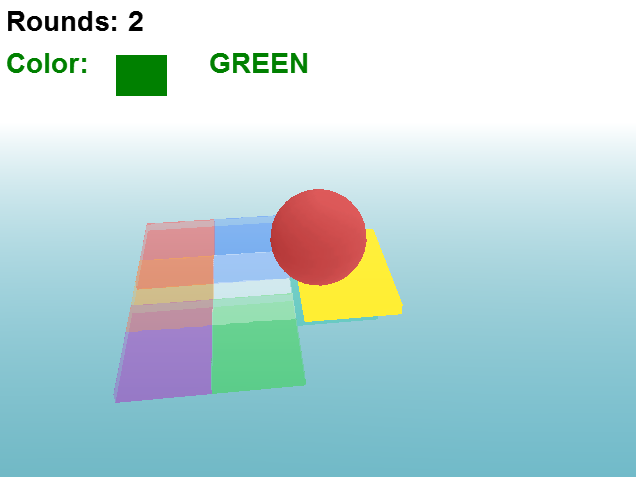

Um minigame simples. Ele te diz uma cor e você tem que parar a bola na plataforma daquela cor (todas as outras cairão em seguida). Foi feito só pra testar as minhas habilidades com programação de jogos em 3D (não são lá grande coisa).

[\[DOWNLOAD\]](https://www.dropbox.com/s/2qodkom4mvv0y2n/Moving%20Platforms.rar?dl=0)

