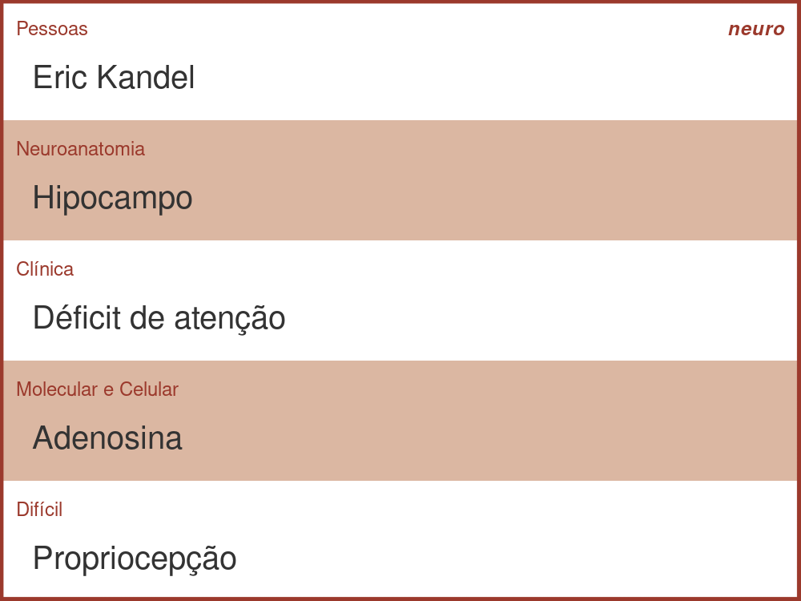
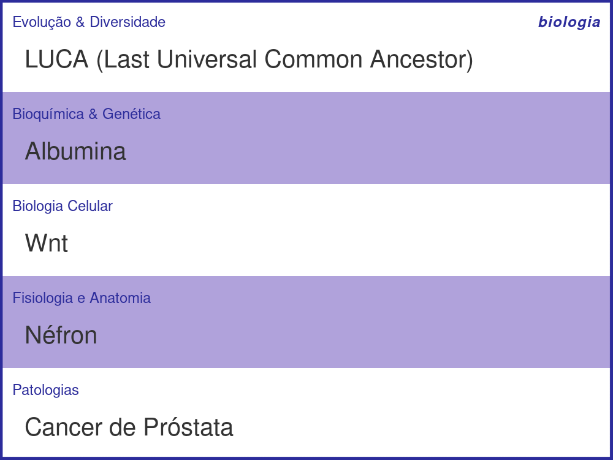
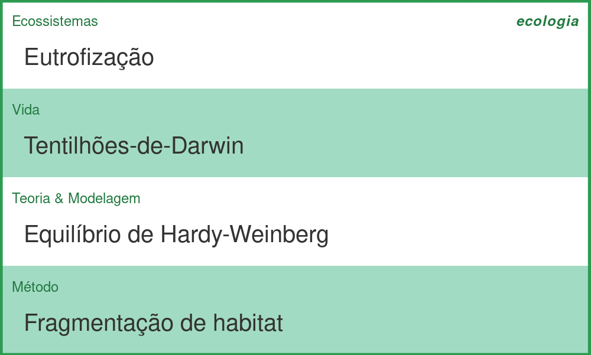

Decks de Pictionary/Imagem & Ação, com temas científicos: neurociência, biologia/saúde e ecologia. Bem especializados, mas ótimo pra grupos de laboratório. Recomendo jogar sem poder "cortar palavras". É o jogo ideal caso o seu círculo de amizades tenha uma proporção alta de cientistas.

Você pode jogar online ou imprimir as cartas.

[Jogar!]()

[\[DOWNLOAD - Cartas Neurociência\]]()

[\[DOWNLOAD - Cartas Biologia e Saúde\]]()

[\[DOWNLOAD - Cartas Ecologia\]]()

___

