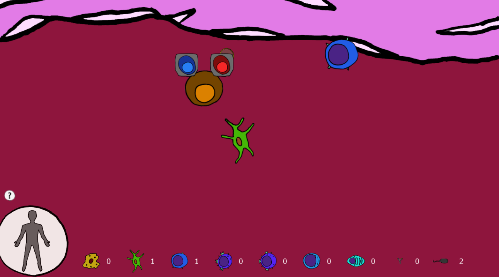
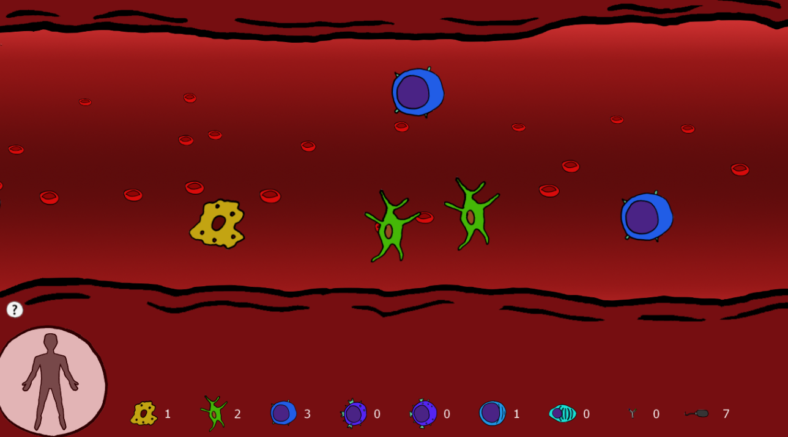
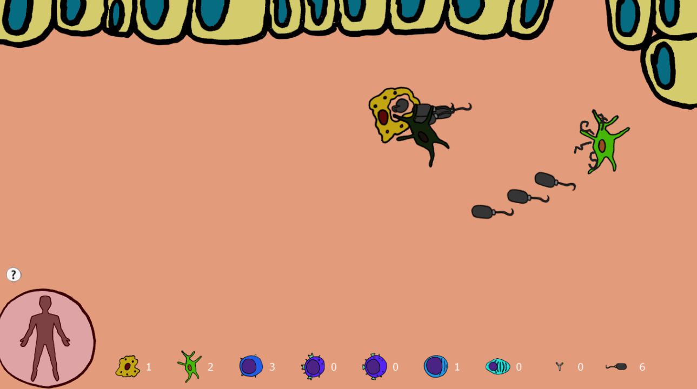

Jogo de estratégia em tempo real onde você produz as unidades do sistema imune pra combater uma infecção. Você escolhe o que fazer com os progenitores, no que diferenciá-los, leva as células aonde elas precisam ir pra amadurecerem e eventualmente direciona elas para o tecido pra lidar com antígenos. Podia ter um tutorial melhor, mas funciona. Eu gosto dos gráficos desse.

[\[DOWNLOAD\]](https://www.dropbox.com/s/j91pms5lfxyx5z8/ImuneSystemGame.zip?dl=0)

