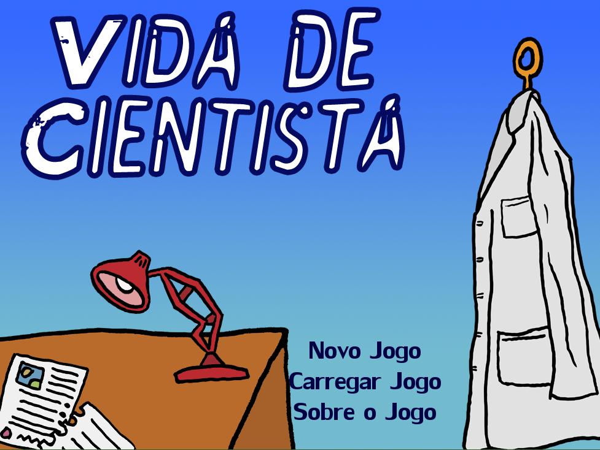
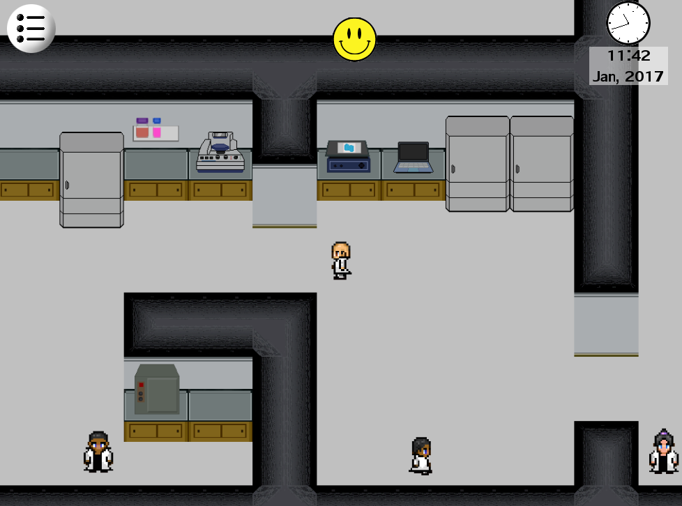
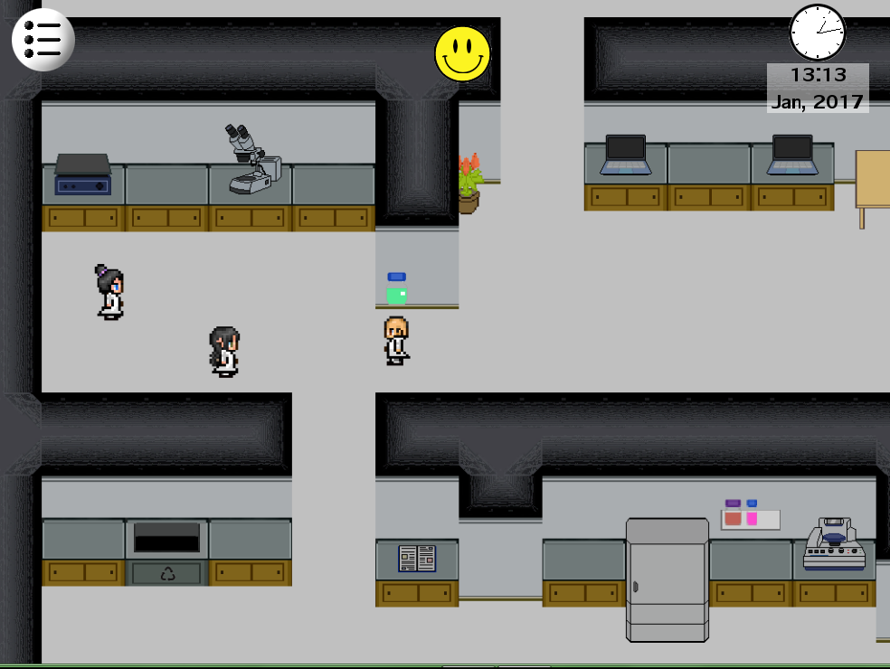

Uma simulação da vida de uma pessoa que faz pós-graduação em alguma ciência biomédica. A mecânica principal é de administração de tempo, pra você poder cumprir todos os requisitos pra poder defender o seu doutorado em quatro anos: fazer todos os experimentos, escrever artigos, ler artigos, assistir aulas, estudar, escrever uma tese ... sem esquecer de passar tempo suficiente em casa e no lazer, pra preservar a sua saúde física e mental (senão os experimentos começam a dar errado). Contém várias piadas (e tristezas) internas a quem faz ou fez pós-graduação na área. Minhas reflexões mais profundas sobre o jogo [nesse texto aqui](https://kneves.org/2021/02/18/o-jogo-da-pos-graduacao/).

[\[DOWNLOAD - PORTUGUÊS\]](https://www.dropbox.com/s/i0fts7caloozjnu/Vida%20de%20Cientista%20PT.zip?dl=0)

[\[DOWNLOAD - ENGLISH\]](https://www.dropbox.com/s/r7xkkmi6y5vg05u/Life%20of%20a%20Scientist%20EN.zip?dl=0)

